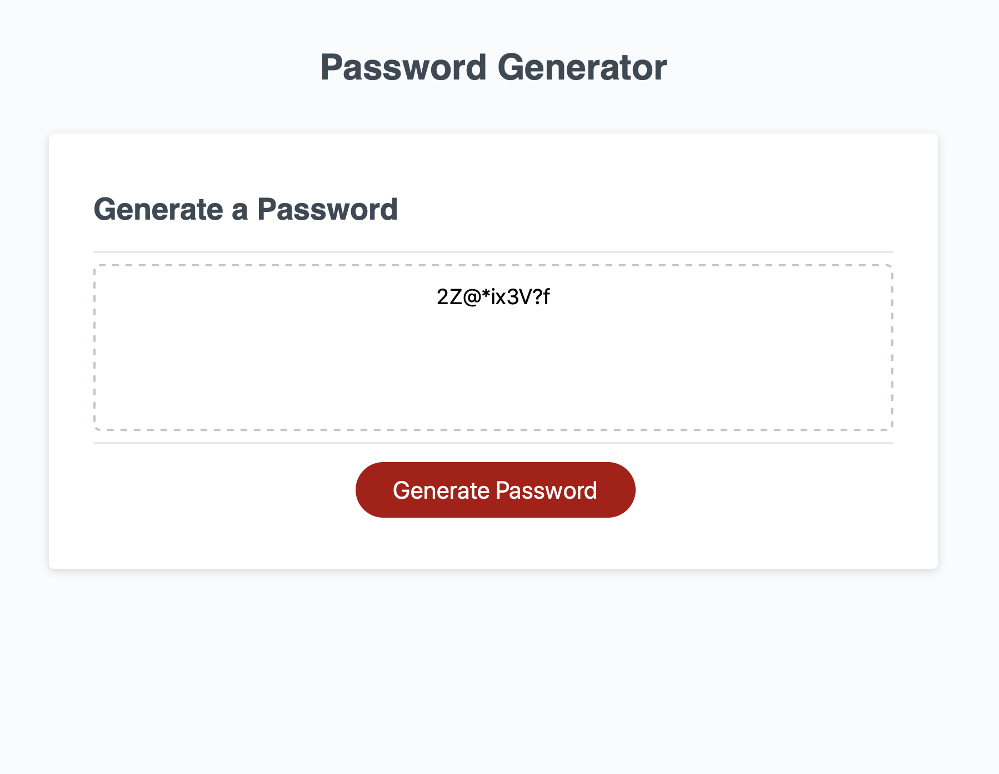
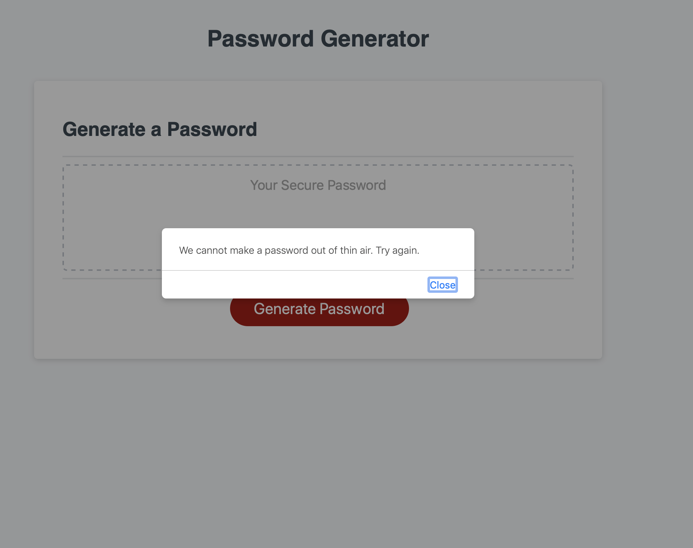
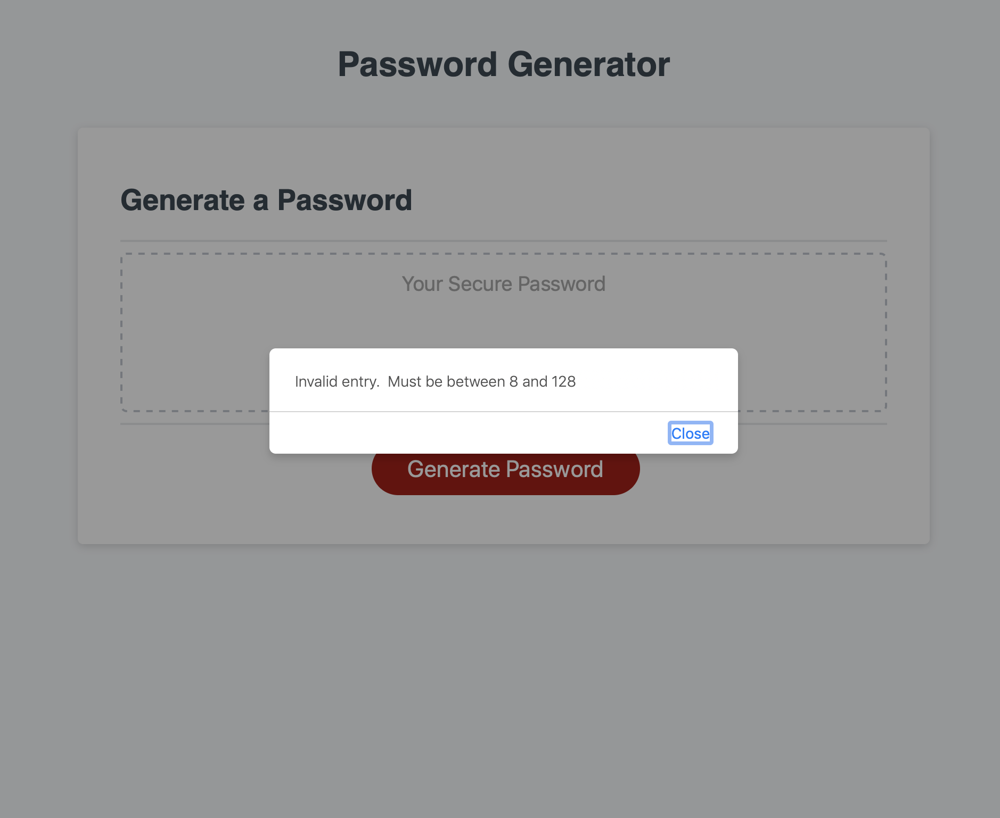

# homework3
John Murphy

This program is designed to generate a random password of 8 to 128 characters, numbers, and letters depending on the user input. Messages alert the user to invalid inputs. 

github: https://github.com/jmurphy0/homework3.git
io: https://jmurphy0.github.io/homework3/ 